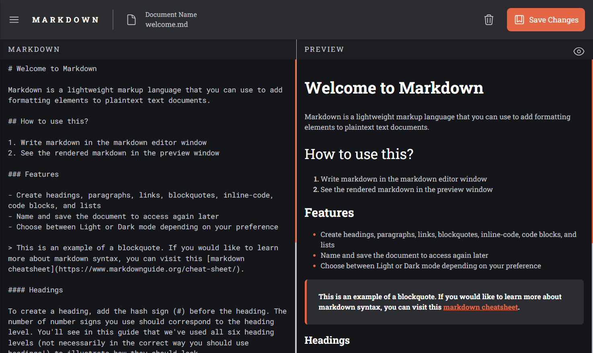

# MarkView Pro

MarkView Pro is a sleek, feature-rich, and responsive Markdown editor designed to enhance your writing experience. With support for live previews, custom themes, and seamless document management, MarkView Pro is perfect for developers, writers, and content creators.

---

## Live Demo

[Play around](https://mark-view-pro.vercel.app/)

## Desktop View



## Features

- **Live Markdown Preview**: Instantly preview your Markdown as you write.
- **Dark Mode Support**: Switch between light and dark themes for optimal comfort.
- **Document Management**: Create, edit, rename, and delete documents with ease.
- **Customizable File Names**: Save your documents with any `.md` extension name.
- **Keyboard Accessible**: Full support for keyboard navigation and shortcuts.
- **Cross-Browser Compatibility**: Works seamlessly on modern browsers.
- **Responsive Design**: Optimized for three breakpoints:
  - **Mobile** (< 768px)
  - **Tablet** (768px – 1024px)
  - **Desktop** (> 1024px)
- **Autosave**: Your documents are automatically saved in local storage.
- **Secure Content**: All data stays in your browser—no external storage or server dependency.
- **Semantic HTML and ARIA**: Built with accessibility in mind, ensuring usability for all users.

---

## Accessibility

MarkView Pro adheres to the following accessibility standards:

- ARIA roles for interactive components.
- Keyboard and screen-reader-friendly controls.
- Color contrast compliant for light and dark themes.
- Clear focus indicators for interactive elements.

---

## Tech Stack

- **Frontend**: React.js (Functional components, Hooks, Context API)
- **Styling**: Tailwind CSS
- **State Management**: React Context API
- **Storage**: LocalStorage for document persistence
- **Markdown Parsing**: Custom Markdown-to-HTML parser
- **Icons**: Heroicons

---

## Installation

1. Clone the repository:

   ```bash
   git clone https://github.com/KeepSerene/in-browser-markdown-editor-fem-react.git
   cd markview-pro
   ```

2. Install dependencies:

   ```bash
   npm install
   ```

3. Start the development server:

   ```bash
   npm start
   ```

4. Open the app in your browser at `http://localhost:3000.`

## Usage

- Create a new Markdown document or select an existing one.
- Write your Markdown in the editor pane.
- Preview your content in real-time in the preview pane.
- Save your work or delete unwanted documents.

## Author

_Dhrubajyoti Bhattacharjee_

- [Portfolio](https://math-to-dev.vercel.app/)

## License

This project is licensed under the MIT License.
